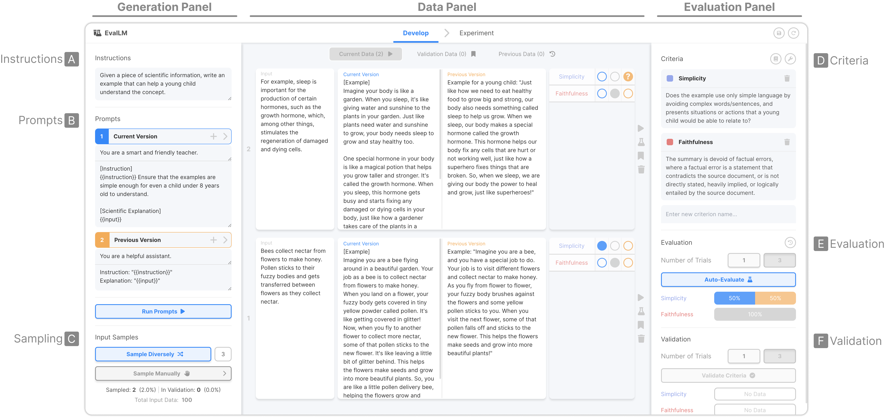

# ⚗️ EvalLM: Interactive Evaluation of Large Language Model Prompts on User-Defined Criteria

EvalLM is an interactive interface that allows users to compare and refine prompts by evaluating their outputs on new, diverse, and subjective criteria defined through natural language.

📢 The interface will be re-built and updated with new features in the coming months!


[**Live Demo**](https://evallm.kixlab.org/demo) (An OpenAI API Key is needed.) | [**CHI 2024 Paper**](https://doi.org/10.1145/3613904.3642216) | [**Website**](https://evallm.kixlab.org/)

## Development

1. Install all the dependencies.

```bash
npm install
```

2. Start the local server.

```bash
npm run start
```

## Interface



The main screen of the interface consists of three panels: (1) **Generation Panel**, (2) **Data Panel**, and (3) **Evaluation Panel**.

In the **Generation Panel**, the user can describe the overall shared instructions for their prompts and then construct two distinct prompt templates that will be compared. The user can also upload a dataset of inputs that they will use to generate outputs for each prompt. This dataset should be a JSON file in the following format: `[ {"input": string, "outputs" (optional): [string, string], "cluster" (optional): number }, ...]` Providing output values allows for evaluating outptus generated outside of the interface and assigning samples with a cluster ID allows for sampling diverse samples for evaluation.

In the **Evaluation Panel**, the user can define their own criteria for evaluation using natural language. They can also select criteria from prior work or use a criteria review assistant to get recommendations on how to improve their criteria. In this panel, the user can also run the automatic evaluations, which will compare each output, provide a score to each output for that criterion, and provide an explanation of this evaluation.

After the user has sampled items from their dataset, they can see them in the **Data Panel**. This panel shows a data sample as a row that contains (1) the input data, (2) the outputs generated by each prompt (or already existing in the dataset), and (3) the results from evaluating each pair of outputs on each criterion defined by the user. The user can click on the evaluation result for a criterion to see the score assigned to each output and the evaluation assistant's explanation.

There is also an additional **Validation Panel**. Here, the user can manually evaluate a couple of samples and, if they run a validation trial, the system will calculate the accuracy of the automatic evaluations when compared to the user's manual evaluations.

For more information, please check our paper.


## CHI 2024 Paper

**EvalLM: Interactive Evaluation of Large Language Model Prompts on User-Defined Criteria**<br />
Tae Soo Kim, Yoonjoo Lee, Jamin Shin, Young-Ho Kim, Juho Kim

**Please cite this paper if you used the code or prompts in this repository.**

> Tae Soo Kim, Yoonjoo Lee, Jamin Shin, Young-Ho Kim, and Juho Kim. 2024. EvalLM: Interactive Evaluation of Large Language Model Prompts on User-Defined Criteria. In Proceedings of the CHI Conference on Human Factors in Computing Systems (CHI '24). Association for Computing Machinery, New York, NY, USA, Article 306, 1–21. https://doi.org/10.1145/3613904.3642216

```bibtex
@inproceedings{10.1145/3613904.3642216,
    author = {Kim, Tae Soo and Lee, Yoonjoo and Shin, Jamin and Kim, Young-Ho and Kim, Juho},
    title = {EvalLM: Interactive Evaluation of Large Language Model Prompts on User-Defined Criteria},
    year = {2024},
    isbn = {9798400703300},
    publisher = {Association for Computing Machinery},
    address = {New York, NY, USA},
    url = {https://doi.org/10.1145/3613904.3642216},
    doi = {10.1145/3613904.3642216},
    booktitle = {Proceedings of the CHI Conference on Human Factors in Computing Systems},
    articleno = {306},
    numpages = {21},
    keywords = {Evaluation, Human-AI Interaction, Large Language Models, Natural Language Generation},
    location = {<conf-loc>, <city>Honolulu</city>, <state>HI</state>, <country>USA</country>, </conf-loc>},
    series = {CHI '24}
}
```

By simply composing prompts, developers can prototype novel generative applications with Large Language Models (LLMs). To refine prototypes into products, however, developers must iteratively revise prompts by evaluating outputs to diagnose weaknesses. Formative interviews (N=8) revealed that developers invest significant effort in manually evaluating outputs as they assess context-specific and subjective criteria. We present EvalLM, an interactive system for iteratively refining prompts by evaluating multiple outputs on user-defined criteria. By describing criteria in natural language, users can employ the system's LLM-based evaluator to get an overview of where prompts excel or fail, and improve these based on the evaluator's feedback. A comparative study (N=12) showed that EvalLM, when compared to manual evaluation, helped participants compose more diverse criteria, examine twice as many outputs, and reach satisfactory prompts with 59% fewer revisions. Beyond prompts, our work can be extended to augment model evaluation and alignment in specific application contexts. 

## Acknowledgements

This work was supported by NAVER-KAIST Hypercreative AI Center. This work was also supported by Institute of Information & Communications Technology Planning & Evaluation (IITP) grant funded by the Korea government (MSIT) (No.2021-0-01347,Video Interaction Technologies Using Object-Oriented Video Modeling). We thank all of our participants for engaging positively in our various studies. We also thank all of the members of KIXLAB for their helpful discussions and constructive feedback. We also credit the [Graphologue Team](https://github.com/ucsd-creativitylab/graphologue) as their README was used as a template for this README.